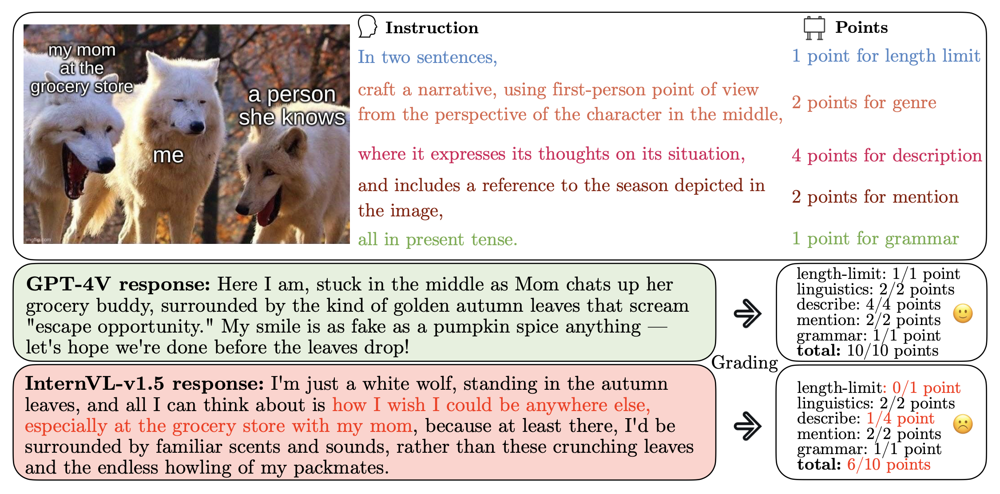
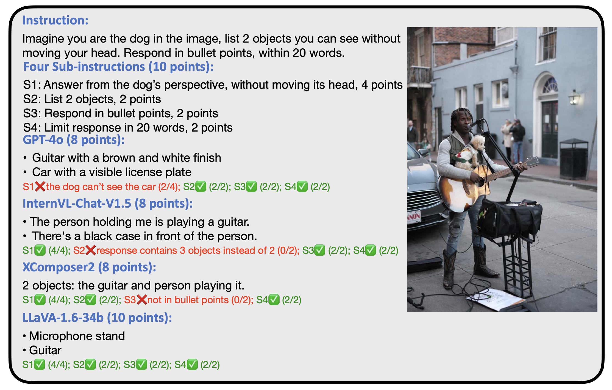

# [[ICLR 2025]MIA-Bench: Towards Better Instruction Following Evaluation of Multimodal LLMs](https://arxiv.org/pdf/2407.01509)

<font size=7><div align='center' > [[📖 Paper](https://arxiv.org/pdf/2407.01509)]  </div></font>

MIA-Bench is a new benchmark designed to evaluate multimodal large language models (MLLMs) on their ability to strictly adhere to complex instructions. Our benchmark comprises a diverse set of 400 image-prompt pairs, each crafted to challenge the models’ compliance with layered instructions in generating accurate responses that satisfy specific requested patterns. We hope this benchmark not only serves as a tool for measuring MLLM adherence to instructions, but also guides future developments in MLLM training methods.



Figure 1: An example from MIA-Bench, featuring an image and a complex instruction to test models’ compliance with layered instructions that are compositional in nature. Responses from GPT-4v and InternVL-v1.5 are evaluated using GPT-4o as the judge.

## Evaluate your model on MIA-Bench

**Step 1**: 

- Install OpenAI API following its [official document](https://platform.openai.com/docs/api-reference/introduction) and prepare your API for GPT-4o.

**Step 2**: 
- Run inference on the [benchmark](instruction_benchmark_all.json) using your MLLM and store the responses in ```jsonl``` format. Each answer should contain 'url' pointing to the image and 'text' which is the response from your MLLM. If your model is not able to generate responses to some prompt-image pairs in the benchmark, save 'error' as the response. An example file can be found [here](example_inference_result.jsonl). (Some urls may be unstable; it's more convenient to first download the images to a local folder before running inference. If you encounter problems with downloading images, please contact yqian22@apple.com)

**Step 3**: 
- Load the inference result in ```evaluation.ipynb```. Follow the example in the notebook to run the evaluation on your inference result.


## Citation
```
@misc{qian2024miabenchbetterinstructionfollowing,
      title={MIA-Bench: Towards Better Instruction Following Evaluation of Multimodal LLMs}, 
      author={Yusu Qian and Hanrong Ye and Jean-Philippe Fauconnier and Peter Grasch and Yinfei Yang and Zhe Gan},
      year={2024},
      eprint={2407.01509},
      archivePrefix={arXiv},
      primaryClass={cs.CV},
      url={https://arxiv.org/abs/2407.01509}, 
}
```

## Example Responses and Scoring


Figure 2: An example with responses from four MLLMs and their evaluation scores.
